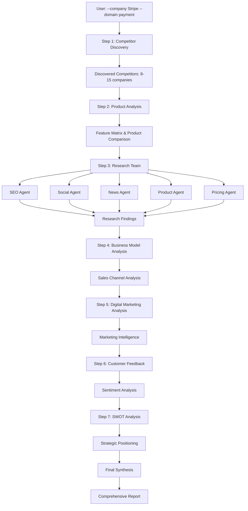

# Competitor Analysis Agent - Complete Documentation

## Table of Contents

1. [What It Does](#what-it-does)
2. [How It Works](#how-it-works)
3. [System Architecture](#system-architecture)
4. [Data Flow Diagram](#data-flow-diagram)
5. [Pipeline Execution](#pipeline-execution)
6. [Agent Roles & Responsibilities](#agent-roles--responsibilities)
7. [Tool Integration](#tool-integration)
8. [Report Generation Process](#report-generation-process)
9. [Usage Examples](#usage-examples)
10. [Technical Implementation](#technical-implementation)

---

## What It Does

The Competitor Analysis Agent is an **AI-powered competitive intelligence system** that automatically:

### Core Capabilities

| Capability | Description | Output |
|------------|-------------|--------|
| **Competitor Discovery** | Automatically finds 8-15 competitors in any market | Categorized competitor list |
| **Product Analysis** | Compares features, integrations, and user experience | Detailed feature matrix |
| **Market Intelligence** | Analyzes SEO, social media, news, and pricing | Multi-dimensional insights |
| **Business Model Analysis** | Evaluates sales channels and GTM strategies | Business model comparison |
| **Customer Sentiment** | Collects and analyzes reviews and feedback | Sentiment analysis report |
| **Strategic Positioning** | Creates SWOT analysis and market positioning | Strategic recommendations |

### Use Cases

| Industry | Example Companies | Analysis Focus |
|----------|-------------------|----------------|
| **Payment Processing** | Stripe, Braintree, Adyen | Market share, pricing models |
| **Note-taking Apps** | Notion, Obsidian, Evernote | Feature comparison, user experience |
| **Developer Hosting** | Vercel, Netlify, Cloudflare Pages | Performance, developer experience |
| **CRM Software** | Salesforce, HubSpot, Pipedrive | Enterprise features, pricing tiers |
| **E-commerce Platforms** | Shopify, BigCommerce, WooCommerce | Merchant tools, transaction fees |

---

## How It Works

### High-Level Process Flow

```
User Input
    |
    v
[STEP 1] Competitor Discovery
    |
    v
[STEP 2] Product Analysis
    |
    v
[STEP 3] Research Team (5 Agents Parallel)
    |
    v
[STEP 4] Business Model Analysis
    |
    v
[STEP 5] Digital Marketing Analysis
    |
    v
[STEP 6] Customer Feedback Analysis
    |
    v
[STEP 7] SWOT Analysis
    |
    v
[FINAL] Report Synthesis
    |
    v
Comprehensive Report
```

### Execution Philosophy

**Hybrid Architecture**: Combines the strengths of both approaches:
- **Individual Agents**: Deep expertise in specific domains
- **Team Coordination**: Parallel execution for efficiency
- **Sequential Pipeline**: Logical data flow and context building

---

## System Architecture

### Component Overview

```
                    +---------------------+
                    |   CLI Interface     |
                    |  (User Input)       |
                    +----------+----------+
                               |
                               v
                    +---------------------+
                    |  Pipeline Orchestrator|
                    |   (Main Function)    |
                    +----------+----------+
                               |
        +----------------------+----------------------+
        |                      |                      |
        v                      v                      v
+-------+--------+    +-------+--------+    +-------+--------+
| Individual      |    | Research Team  |    | Synthesis Team  |
| Agents          |    | (5 Agents)     |    | (Final Report)  |
+-------+--------+    +-------+--------+    +-------+--------+
        |                      |                      |
        v                      v                      v
+-------+--------+    +-------+--------+    +-------+--------+
| Search Tools    |    | Search Tools    |    | OpenRouter     |
| (Tavily/Serper) |    | (Tavily/Serper) |    | Models         |
+-------+--------+    +-------+--------+    +-------+--------+
        |                      |                      |
        v                      v                      v
+-------+--------+    +-------+--------+    +-------+--------+
| Web Scraping    |    | Web Scraping    |    | Report         |
| (Firecrawl)     |    | (Firecrawl)     |    | Generation     |
+-----------------+    +-----------------+    +-----------------+
```

### Technology Stack

| Layer | Technology | Purpose |
|-------|------------|---------|
| **AI Framework** | Agno | Agent orchestration and workflow management |
| **Language Models** | OpenRouter (GPT-5.4) | Natural language processing and analysis |
| **Search Engines** | Tavily + Serper | Comprehensive web search and data collection |
| **Web Scraping** | Firecrawl | Direct content extraction from websites |
| **CLI Interface** | Python argparse | Command-line user interaction |
| **Environment** | python-dotenv | Secure API key management |

---

## Data Flow Diagram

### Step-by-Step Data Flow



### Information Flow Between Steps

| Step | Input | Processing | Output |
|------|-------|------------|--------|
| **1. Discovery** | Company + Domain | Multi-source research | Competitor list + profiles |
| **2. Product** | Competitor list | Feature extraction | Product comparison matrix |
| **3. Research** | All competitors | Parallel analysis | Multi-dimensional data |
| **4. Business** | Research data | Model analysis | Business comparison |
| **5. Marketing** | Previous data | Marketing analysis | Digital presence report |
| **6. Feedback** | All data | Sentiment analysis | Customer insights |
| **7. SWOT** | All data | Strategic analysis | Positioning assessment |
| **8. Synthesis** | All steps | Report generation | Final comprehensive report |

---

## Pipeline Execution

### Detailed Step Breakdown

#### Step 1: Competitor Discovery
```
Input: Company + Domain
Process:
  - Search for "[Company] competitors alternatives"
  - Search for "top [Domain] companies platforms"
  - Search for "[Company] vs [Domain] competitors"
  - Scrape competitor websites for profiles
Output: 8-15 categorized competitors with detailed profiles
```

#### Step 2: Product Analysis
```
Input: Discovered competitors
Process:
  - Extract complete feature lists
  - Create comparison matrix
  - Analyze integrations and ecosystem
  - Assess user experience and sentiment
Output: Detailed product comparison with feature matrix
```

#### Step 3: Research Team (Parallel Execution)
```
Input: All competitors
Process: 5 agents working simultaneously
  - SEO Agent: Traffic, keywords, content strategy
  - Social Agent: Platform presence, engagement
  - News Agent: Recent developments, funding, launches
  - Product Agent: Capabilities, differentiators
  - Pricing Agent: Models, plans, value propositions
Output: Comprehensive multi-dimensional research data
```

#### Step 4: Business Model Analysis
```
Input: Research findings
Process:
  - Analyze sales channels (self-serve, enterprise, etc.)
  - Evaluate GTM strategies
  - Assess effectiveness signals
  - Compare business models across competitors
Output: Business model comparison and effectiveness report
```

#### Step 5: Digital Marketing Analysis
```
Input: Previous analysis data
Process:
  - Analyze platform presence
  - Evaluate content strategies
  - Measure engagement patterns
  - Assess marketing effectiveness
Output: Digital marketing intelligence report
```

#### Step 6: Customer Feedback Analysis
```
Input: All previous data
Process:
  - Collect reviews from multiple sources
  - Analyze sentiment and themes
  - Identify pain points and praise
  - Extract feature requests
Output: Customer sentiment analysis and insights
```

#### Step 7: SWOT Analysis
```
Input: All collected data
Process:
  - Analyze strengths and weaknesses
  - Identify opportunities and threats
  - Assess market positioning
  - Create strategic insights
Output: Comprehensive SWOT analysis
```

---

## Agent Roles & Responsibilities

### Individual Agents

| Agent | Primary Role | Key Tasks | Tools Used |
|-------|--------------|-----------|------------|
| **Competitor Discovery** | Market mapping | Find competitors, categorize, profile | Search + Scraping |
| **Product Analysis** | Feature comparison | Extract features, create matrix, analyze UX | Search + Scraping |
| **Business Model** | Revenue analysis | Sales channels, GTM, effectiveness | Search + Scraping |
| **Digital Marketing** | Presence analysis | Platform analysis, content strategy | Search + Scraping |
| **Customer Feedback** | Sentiment analysis | Reviews, sentiment, feature requests | Search + Scraping |
| **SWOT Analysis** | Strategic positioning | Strengths/weaknesses, opportunities/threats | Search + Scraping |

### Research Team (Parallel Execution)

```
Research Team Coordinator
    |
    +-- SEO & Traffic Analyst
    |   - Organic search performance
    |   - Keyword strategy analysis
    |   - Content strategy assessment
    |
    +-- Social Media Analyst
    |   - Platform presence analysis
    |   - Audience engagement metrics
    |   - Content strategy evaluation
    |
    +-- News & Intelligence Analyst
    |   - Recent developments tracking
    |   - Funding and acquisition news
    |   - Strategic move identification
    |
    +-- Product Features Analyst
    |   - Capability assessment
    |   - Differentiator identification
    |   - Integration ecosystem analysis
    |
    +-- Pricing Analyst
    |   - Pricing model analysis
    |   - Plan structure comparison
    |   - Value proposition assessment
```

---

## Tool Integration

### Search Engine Integration

| Tool | Strengths | Use Cases | Coverage |
|------|-----------|-----------|----------|
| **Tavily** | Real-time search, academic sources | Recent developments, technical analysis | Broad web coverage |
| **Serper** | Google search integration | General web search, company information | Google index |

### Web Scraping Capabilities

```
Firecrawl Integration:
    |
    +-- Direct Website Scraping
    |   - Product pages
    |   - Pricing pages
    |   - Feature documentation
    |
    +-- Content Extraction
    |   - Blog posts
    |   - News articles
    |   - Company announcements
    |
    +-- Limitations
    |   - LinkedIn (authentication required)
    |   - Twitter/X (anti-bot protection)
    |   - Some protected sites
```

### Model Integration

```
OpenRouter Model Usage:
    |
    +-- Coordinator Model (GPT-5.4)
    |   - Team coordination
    |   - Report synthesis
    |   - Complex analysis tasks
    |
    +-- Agent Models (GPT-5.4)
    |   - Individual agent tasks
    |   - Specialized analysis
    |   - Data processing
    |
    +-- Context Management
    |   - Token optimization
    |   - Data summarization
    |   - Overflow prevention
```

---

## Report Generation Process

### Report Structure Visualization

```
Comprehensive Report Structure:
    |
    +-- 1. Executive Summary
    |   - Key findings (2-3 paragraphs)
    |   - Strategic insights
    |   - Critical takeaways
    |
    +-- 2. Target Company Analysis
    |   - Company profile
    |   - Market position
    |   - Competitive advantages
    |
    +-- 3. Competitive Landscape
    |   - Competitor categorization table
    |   - Market share analysis
    |   - Positioning matrix
    |
    +-- 4. Product Comparison Matrix
    |   - Feature comparison table
    |   - Integration analysis
    |   - User experience assessment
    |
    +-- 5. Research Team Findings
    |   - SEO analysis (traffic, keywords)
    |   - Social media presence
    |   - Recent developments
    |   - Product capabilities
    |   - Pricing analysis
    |
    +-- 6. Business Model Analysis
    |   - Sales channel comparison
    |   - GTM strategy assessment
    |   - Effectiveness metrics
    |
    +-- 7. Digital Marketing Analysis
    |   - Platform presence
    |   - Content strategy
    |   - Engagement metrics
    |
    +-- 8. Customer Feedback Summary
    |   - Sentiment analysis
    |   - Pain points
    |   - Feature requests
    |
    +-- 9. SWOT Analysis
    |   - Strengths/Weaknesses by competitor
    |   - Market opportunities
    |   - Competitive threats
    |
    +-- 10. Strategic Recommendations
    |   - Actionable insights
    |   - Competitive strategies
    |   - Market opportunities
    |
    +-- 11. Market Positioning Analysis
    |   - Competitive positioning map
    |   - Strategic groups
    |   - Market segmentation
    |
    +-- 12. Competitive Intelligence Summary
    |   - Key takeaways
    |   - Success factors
    |   - Future trends
```

### Data Visualization Elements

| Section | Visual Elements | Purpose |
|---------|----------------|---------|
| **Competitive Landscape** | Categorization table, positioning matrix | Market overview |
| **Product Comparison** | Feature matrix, integration diagram | Feature analysis |
| **Research Findings** | Metrics tables, comparison charts | Multi-dimensional data |
| **Business Models** | Model comparison table, effectiveness chart | Strategy analysis |
| **SWOT Analysis** | SWOT matrix per competitor | Strategic positioning |

---

## Usage Examples

### Example 1: Payment Processing Analysis

```bash
# Command
python main.py --company "Stripe" --domain "payment processing"

# Expected Output
- 12 competitors discovered (Braintree, Adyen, PayPal, etc.)
- 50+ page comprehensive report
- Feature comparison matrix
- Pricing model analysis
- Strategic recommendations
```

### Example 2: Note-taking Apps Analysis

```bash
# Command
python main.py --company "Notion" --domain "note-taking apps" --initial_competitors "Obsidian"

# Expected Output
- 8 competitors discovered
- Product feature matrix
- User sentiment analysis
- Market positioning insights
```

### Example 3: Developer Hosting Analysis

```bash
# Command
python main.py --company "Vercel" --domain "developer hosting" --output "./vercel_analysis.md"

# Expected Output
- Custom report location
- Developer experience comparison
- Performance analysis
- Pricing strategy assessment
```

### Real-World Output Sample

```
# Payment Processing Competitor Analysis Report
**Focus:** Stripe, Braintree, Adyen, PayPal  
**Domain:** Payment Processing

## Executive Summary

Stripe leads the payment processing market with superior developer experience,
comprehensive product ecosystem, and strong innovation velocity. Braintree
maintains relevance through PayPal integration, while Adyen excels in
enterprise global payments...

## Competitive Landscape

| Competitor | Category | Market Position | Key Strength |
|------------|----------|-----------------|--------------|
| Stripe | Market Leader | #1 | Developer experience |
| Braintree | Challenger | #3 | PayPal ecosystem |
| Adyen | Enterprise | #2 | Global reach |
| PayPal | Incumbent | #4 | Brand recognition |

## Product Comparison Matrix

| Feature | Stripe | Braintree | Adyen | PayPal |
|----------|--------|-----------|--------|---------|
| API Quality | Excellent | Good | Good | Fair |
| Global Reach | 135+ countries | 45+ countries | 200+ countries | 200+ countries |
| Developer Docs | Excellent | Good | Good | Basic |
| Pricing | 2.9% + $0.30 | 2.9% + $0.30 | Custom | 2.9% + $0.30 |
```

---

## Technical Implementation

### Code Architecture

```
main.py (Entry Point)
    |
    +-- CLI Interface (argparse)
    |   - Parameter parsing
    |   - Help generation
    |   - Input validation
    |
    +-- Pipeline Orchestrator
    |   - Step execution
    |   - Data flow management
    |   - Error handling
    |
    +-- Agent Definitions
    |   - Individual agents
    |   - Team composition
    |   - Tool integration
    |
    +-- Report Generation
    |   - Content synthesis
    |   - Markdown formatting
    |   - File output
    |
    +-- Configuration
    |   - Model settings
    |   - API keys
    |   - Tool parameters
```

### Key Functions

| Function | Purpose | Parameters | Return |
|----------|---------|------------|--------|
| `parse_args()` | CLI argument parsing | None | Parsed arguments |
| `competitor_discovery_agent()` | Create discovery agent | None | Agent instance |
| `research_team()` | Create research team | None | Team instance |
| `create_synthesis_team()` | Create final synthesis team | None | Team instance |
| `save_report()` | Save report to file | Content, path, domain | File path |
| `main()` | Main execution function | None | None |

### Configuration Management

```python
# Model Configuration
COORDINATOR_MODEL = "openai/gpt-5.4"
AGENT_MODEL = "openai/gpt-5.4"

# Tool Configuration
def search_tools():
    return [TavilyTools(), SerperTools()]

def crawl_tools():
    return FirecrawlTools()

# Environment Variables
OPENROUTER_API_KEY
TAVILY_API_KEY
SERPER_API_KEY
FIRECRAWL_API_KEY
```

### Error Handling Strategy

```
Error Handling Hierarchy:
    |
    +-- API Limit Errors
    |   - Graceful degradation
    |   - User notification
    |   - Partial report generation
    |
    +-- Scraping Failures
    |   - Search fallback
    |   - Limitation acknowledgment
    |   - Alternative data sources
    |
    +-- Context Overflow
    |   - Data summarization
    |   - Selective inclusion
    |   - Step-by-step optimization
    |
    +-- Network Issues
    |   - Retry mechanisms
    |   - Timeout handling
    |   - Recovery procedures
```

---

## Performance Characteristics

### Execution Metrics

| Metric | Typical Value | Optimization |
|--------|---------------|-------------|
| **Total Execution Time** | 5-15 minutes | Parallel processing |
| **API Calls per Analysis** | 50-100 calls | Caching strategies |
| **Tokens Used** | 50K-200K tokens | Context optimization |
| **Data Sources Analyzed** | 20-50 websites | Tool selection |
| **Report Length** | 30-80 pages | Content structuring |

### Scalability Features

- **Horizontal Scaling**: Multiple agents can run in parallel
- **Vertical Scaling**: Model selection based on complexity
- **Resource Management**: Token and API usage optimization
- **Caching**: Result caching for repeated analyses

---

## Quality Assurance

### Output Quality Indicators

| Quality Dimension | Measurement | Target |
|-------------------|-------------|--------|
| **Data Accuracy** | Cross-source validation | >90% accuracy |
| **Coverage Depth** | Competitor analysis completeness | 8-15 competitors |
| **Insight Quality** | Actionable strategic recommendations | High relevance |
| **Report Structure** | Section completeness and formatting | Professional standard |
| **Technical Accuracy** | Correct technical details | High precision |

### Validation Processes

```
Quality Validation Pipeline:
    |
    +-- Input Validation
    |   - Company existence verification
    |   - Domain relevance check
    |   - Parameter validation
    |
    +-- Process Validation
    |   - Step completion verification
    |   - Data quality checks
    |   - Tool success monitoring
    |
    +-- Output Validation
    |   - Report structure validation
    |   - Content quality assessment
    |   - Format verification
    |
    +-- User Validation
    |   - Readability assessment
    |   - Actionability review
    |   - Completeness verification
```

---

## Conclusion

The Competitor Analysis Agent represents a **sophisticated AI-powered system** that combines:

- **Multi-Agent Architecture**: Specialized agents for different analysis dimensions
- **Hybrid Execution**: Sequential pipeline with parallel team processing
- **Comprehensive Data Collection**: Multiple search engines and web scraping
- **Advanced AI Models**: State-of-the-art language models for analysis
- **Professional Reporting**: Structured, actionable competitive intelligence

The system transforms competitive intelligence from manual research into an **automated, comprehensive, and actionable** process that delivers enterprise-grade analysis in minutes rather than weeks.

---

*This documentation provides a complete understanding of the Competitor Analysis Agent's functionality, architecture, and implementation details.*
